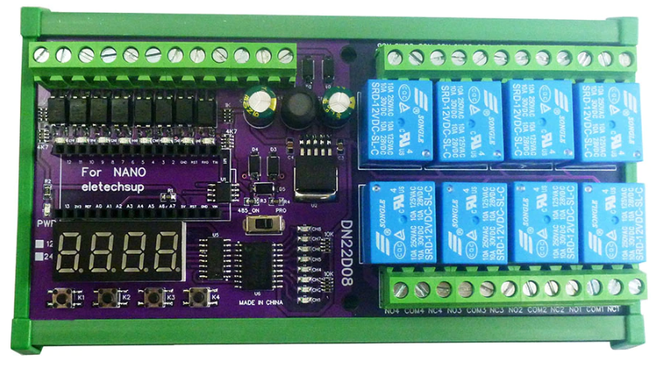

# Arduino Nano PLC IO RS485 (DN22D08)

 
 
 * danieltronic808@gmail.com

 ## Description
 This library provides a simple to use interface
 an Arduino Nano with a PLC IO RS485 board DN22D08 for controls the output relays and
 multiplexes the 7-segment display to display numerical values.
 
 ## Dependencies

TimerOne Library

https://github.com/PaulStoffregen/TimerOne
